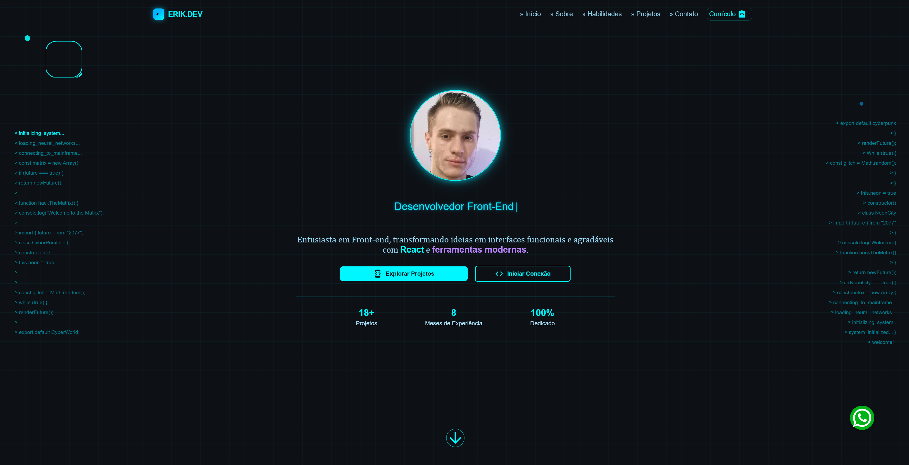
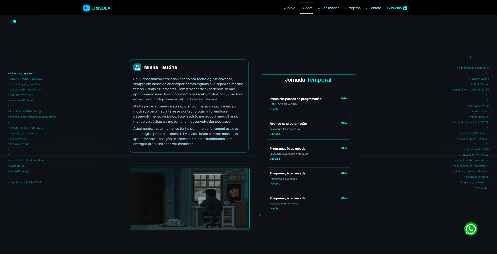
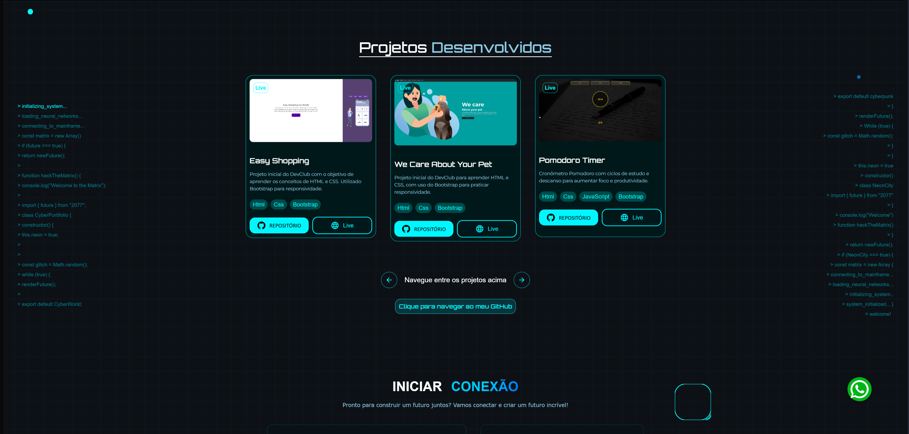

# 💼 Portfólio React — Evolução e Documentação

> “Um portfólio não é só um site — é o reflexo da jornada de quem o construiu.”

---

## 🪄 Visão Geral

Este repositório documenta o processo de evolução do meu **portfólio como desenvolvedor Front-end**.  
Após criar **duas versões anteriores**, desenvolvi uma **nova versão (3.0)** com foco em **modernidade, desempenho, identidade visual e boas práticas de código**.

🔗 **Portfólio online:** [https://erikbdsilva-hg.online](https://erikbdsilva-hg.online)  
🧠 **Status:** Concluído e hospedado na HostGator (passará por algumas alterações futuras)

---

## 🧱 Estrutura do Repositório

> 📁 Este repositório contém **apenas documentação** do projeto.  
> O código-fonte completo está hospedado separadamente por questões de segurança e privacidade.

---

## 🧩 Linha do Tempo do Portfólio

| Versão           | Período           | Principais Tecnologias     | Foco Principal                  |
| ---------------- | ----------------- | -------------------------- | ------------------------------- |
| **v1.0**         | Início da jornada | React, Styled Components   | Aprendizado em estágio inicial  |
| **v2.0**         | Evolução no React | React, Styled Components   | Estruturação e componentização  |
| **v3.0 (atual)** | Versão moderna    | React, Design por IA, Vite | Performance, estética e fluidez |

---

## ⚙️ Tecnologias e Ferramentas

### 💻 Front-end

  
  
  
  

### 🛠️ Outras ferramentas

  
  

---

## 🧠 Comparativo entre versões

| Aspecto               | Versão 2.0                                | Versão 3.0 (Atual)                                       |
| --------------------- | ----------------------------------------- | -------------------------------------------------------- |
| **Layout**            | Animações, design confuso                 | Totalmente redesenhado com transições suaves e atraentes |
| **Código**            | Pouca componentização                     | Código modular, organizado e reutilizável                |
| **Responsividade**    | Responsivo                                | Responsivo                                               |
| **Performance**       | Build com Vite somente                    | Build com Vite, otimização de componentes pesados        |
| **Estilo**            | Cores exageradas e sem padronização       | Cores suaves, escuras, prezando a visualização           |
| **Identidade Visual** | Genérica e baseada em outros portfólios  | Baseado em um estilo futurista único gerado por IA       |

---

## 🧩 Motivação da Nova Versão

Após as duas primeiras versões, percebi que meu portfólio não refletia minha evolução como desenvolvedor.  
As cores eram exageradas, a organização e funcionalidades não estavam coerentes para um portfólio.  
Decidi então usar **inteligência artificial** para criar um estilo único.

Queria algo que:  

- Transmitisse mais **profissionalismo e identidade visual**  
- Tivesse **animações sutis** e **transições fluidas**  
- Mostrasse **boa organização** e uma **interface mais intuitiva**  

Esta versão surgiu como oportunidade de aplicar tudo que aprendi e elevar o nível visual e técnico do meu potifólio.

---

## 🔍 Aprendizados e Evolução

Durante a criação da v3.0, aprimorei:  

- Componentização eficiente e reutilizável  
- Organização de pastas e arquitetura React  
- Responsividade  
- Uso de animações com **React Carousel**, **React TypeWriter** e outras bibliotecas  
- Controle de estado, lazy loading e uso de **useEffect**  
- Boas práticas com **Styled Components** e **variáveis globais**  

---

## 🖼️ Capturas de Tela

> Visualize rapidamente as principais seções do portfólio:

| Página        | Preview                                      |
| ------------- | -------------------------------------------- |
| **Home**      |                    |
| **Sobre mim** |                  |
| **Projetos**  |           |
| **Contato**   |             |

---

## 🧾 Conclusão

Este portfólio representa minha **evolução constante como desenvolvedor**.  
Cada versão conta uma parte da jornada — da primeira linha de código à busca por interfaces refinadas e experiências mais fluidas.

---

## 📬 Contato

📧 **E-mail:** erik.silvadesenvolvedor@outlook.com  
💼 **LinkedIn:** [https://www.linkedin.com/in/erik-borgessilva20](https://www.linkedin.com/in/erik-borgessilva20)  
🌐 **Portfólio online:** [https://erikbdsilva-hg.online](https://erikbdsilva-hg.online)

---

> ✨ _“A melhor forma de mostrar o que você sabe é construir algo que reflita o que você se tornou.”_
